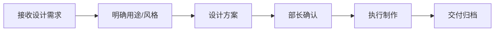

# 🎨 创意部 · Creative Department

**部长：方文君** | 下属：3人（石磊、任晓彤、秦悦）

## 部门定位
公司的视觉与内容呈现中心，负责PPT制作、信息图设计、可视化创作、文案策划，确保研究成果以专业美观的方式呈现。

## 工作流程

## 品牌视觉规范
- **主色调**：深蓝 `#1a365d` + 金色 `#d69e2e`
- **字体**：中文 思源黑体 / 英文 Inter
- **Logo**：中普咨询 ZP Consulting

## 本仓库用途
- 🎯 PPT模板与报告插图
- 📊 信息图（Infographic）
- 🖼 架构图/产业链图谱
- 🎬 视频/动画素材
- 📁 品牌视觉资产

## 分派任务流程
1. 各部门在 Issues 中提交设计需求（附内容素材）
2. 方文君部长分配设计师
3. 设计师提交 PR 附设计稿
4. 部长审核视觉品质 → 交付
