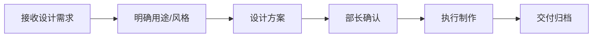
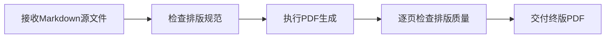

# 🎨 创意部 · Creative Department

**部长：方文君** | 下属：4人（石磊·排版设计、任晓彤·视觉设计、秦悦·内容策划）

## 部门定位
公司的视觉与内容呈现中心，负责PPT制作、报告排版与PDF终版制作、信息图设计、可视化创作、文案策划，确保研究成果以专业美观的方式呈现。

## 新增职能：报告排版
创意部2026年6月起承担**报告排版与PDF终版制作**职责：
- 使用 Pandoc+Typst 流水线将报告Markdown源文件转换为专业PDF
- 执行《报告排版标准规范》（楷体11pt/LibertinusSerif）
- 封面设计、页眉页脚、图表嵌入与编号
- 排版质量终审 → 由方文君部长把关

排版标准参考：[report-formatting-standard skill](https://hermes-agent.nousresearch.com/docs/skills/report-formatting-standard)

## 工作流程

## 品牌视觉规范
- **主色调**：深蓝 `#1a365d` + 金色 `#d69e2e`
- **字体**：中文 思源黑体 / 英文 Inter
- **Logo**：中普咨询 ZP Consulting

## 本仓库用途
- 🎯 PPT模板与报告插图
- 📊 信息图（Infographic）
- 📄 报告排版规范与PDF模板
- 🖼 架构图/产业链图谱
- 🎬 视频/动画素材
- 📁 品牌视觉资产

## 分派任务流程
1. 各部门在 Issues 中提交设计/排版需求（附内容素材）
2. 方文君部长分配任务（设计师/排版师）
3. 设计师/排版师提交 PR 附设计稿或PDF
4. 部长审核视觉品质与排版质量 → 交付
